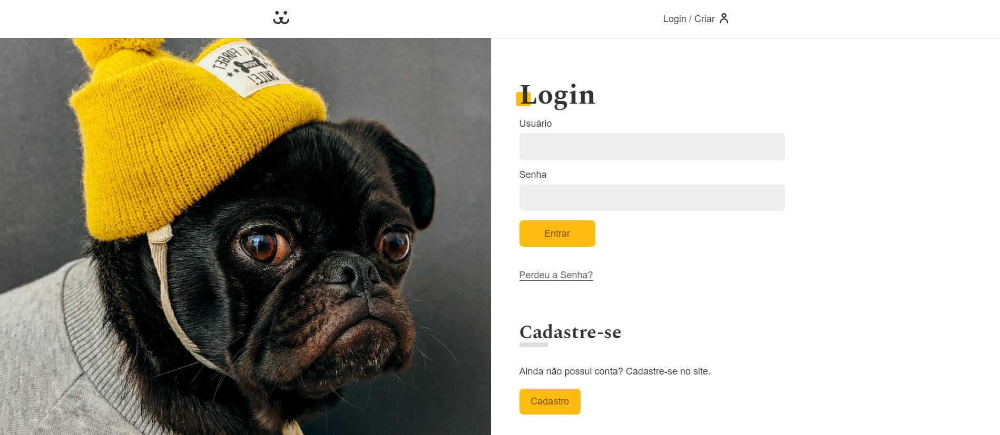
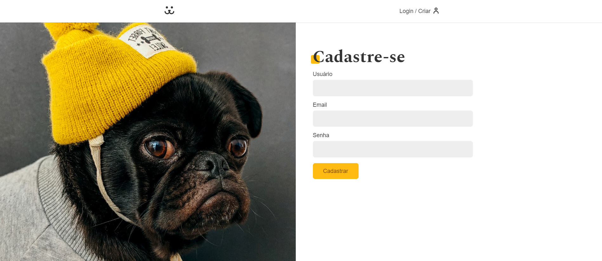
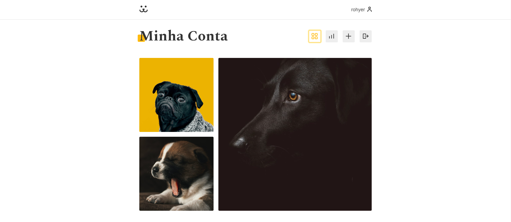
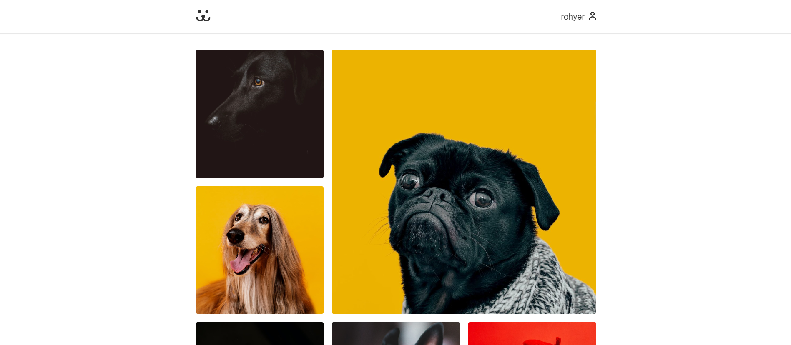
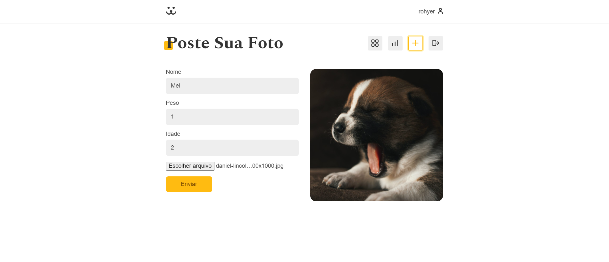
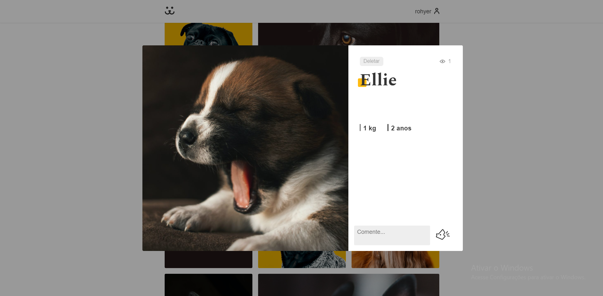
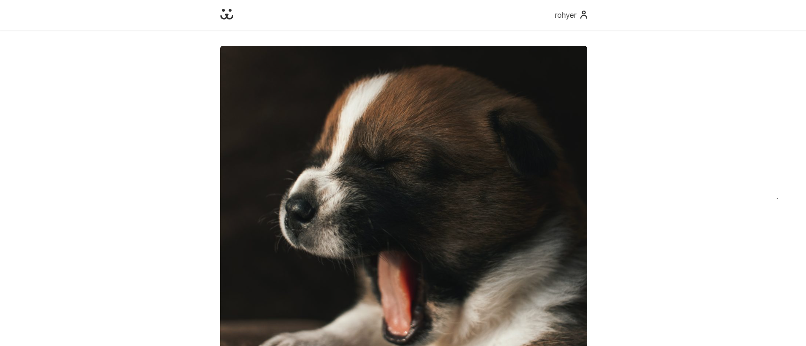
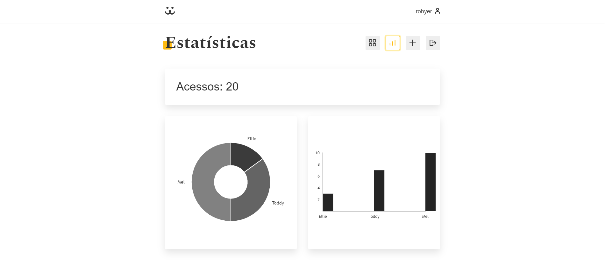
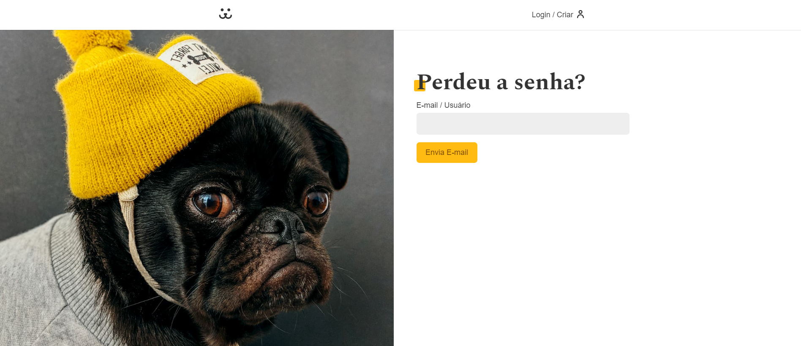

# Dogs - Rede Social para Cachorros

Link: https://dogs.guilhermerldev.com/

O projeto é uma rede social para cachorros.
Nele podemos postar fotos especificando o peso e idade de seu cachorro, onde elas são dispostas em um grid com um layout limpo.

O site é uma Single Page Application desenvolvida com HTML, CSS, JavaScript, React, React Router DOM, Vite e a biblioteca de gráficos Victory.

Funcionalidades que o site possui:

- Cadastro de usuário
- Login de usuário
- Cadastro de postagem
- Apagar postagem
- Trocar senha caso tenha sido perdida

## Para rodar o projeto

- yarn install
- yarn dev

### Imagens do projeto

